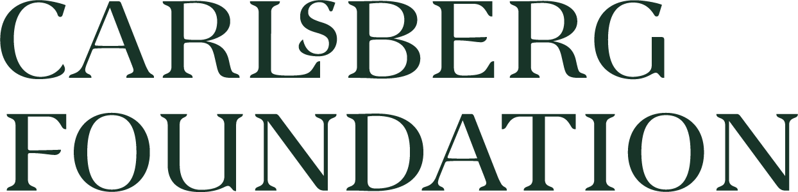

# Economic diversity and labour specialization in the (Greek speaking) Roman East 

## About
This repository aims to explore the occupational diversity and labour specialization in Greek inscriptions as part of the Past Social Network project.

## Authors
* Petra Hermankova 
* Matteo Mazzamurro , PSN, Aarhus University
* Tom Brughmans , PSN, Aarhus University
* [Name], [ORCID], [Institution], 
* [Name], [ORCID], [Institution]
* [Name], [ORCID], [Institution]

## Funding
*The Past Social Networks Projects* is funded by The Carlsberg Foundation’s Young Researcher Fellowship (CF21-0382) in 2022-2026. 

## License
CC-BY-SA 4.0, see attached [License](./License.md)

## Data

1. List of Greek occupations, based on:
    - Lewis, D. (2020). Labour Specialization in the Athenian Economy: Occupational Hazards. In E. Stewart, E. Harris, & D. Lewis (Eds.), _Skilled Labour and Professionalism in Ancient Greece and Rome_ (pp. 129-174). Cambridge: Cambridge University Press. doi:10.1017/9781108878135.005 
    - Harris, E. M. (2002). Workshop, marketplace and household: the nature of technical specialisation in classical Athens and its influence on economy and society. In P. A. Cartledge, E. E. Cohen, and L. Foxhall (Eds.), _Money, Labour, and Land: Approaches to the Economies of Ancient Greece_ (pp. 67–99). London.

1. Dataset of Greek inscriptions (GI) aggregated from I.PHI https://zenodo.org/record/7185509 (details TBA)

## Scripts
[Describe what individual scripts do, provide links to them, and order them in a sequence they should run. Point to any issues or specific settings people should be aware of.]

## Screenshots

## DOI
TBA

## How to cite us
TBA

---

